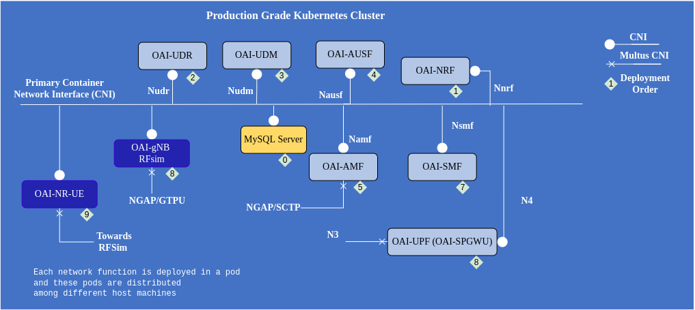

<table style="border-collapse: collapse; border: none;">
  <tr style="border-collapse: collapse; border: none;">
    <td style="border-collapse: collapse; border: none;">
      <a href="http://www.openairinterface.org/">
         
         </img>
      </a>
    </td>
    <td style="border-collapse: collapse; border: none; vertical-align: center;">
      <b><font size = "5">OpenAirInterface 5G Core Network Deployment using Helm Charts</font></b>
    </td>
  </tr>
</table>

OAI 5G core network have different network functions which can be used invidiually or deployed all together in different combination on a production grade Kubernetes cluster like Openshift or a vanilla kubernetes cluster. 





**Reading time**: ~20 mins

**Tutorial replication time**: ~40mins

**TABLE OF CONTENTS**

1.  [Description](#1-description)
2.  [Building Images](#2-building-images)
3.  [Configuring Helm Charts](#3-configuring-helm-charts)
4.  [Deploying 5g Core Helm Charts](#4-deploying-helm-charts)
5.  [Optional: Testing with OAI gNB RFsimulator and NR-UE](#5-testing-with-oai-gnb-rfsimulator-and-nr-ue)
6.  [Extra](#6-extra)


### Pre-requisite

The cluster on which these helm charts will be deployed should have RBAC and [Multus CNI](https://github.com/k8snetworkplumbingwg/multus-cni). Multus is necessary to provide multiple interfaces to AMF and UPF/SPGWU. In case you don't have multus CNI for seconary network interface inside the pod you can still use the ethernet interface provided by the primary CNI. This type of setting is only recommended for playing with rfsimulator. In case you are using minikube or any other Kubernetes deployer make sure have minimum 4 CPU and 16 GBi of ram. 

The gNB simulator requires lot of resources. The configuration of the machine on which we tested the charts using minikube had 8 CPU (hyperthreaded) and 16 GBi of ram with intel core i5 8th generation.

Clone the git repository 

```console 
$: git clone -b master https://gitlab.eurecom.fr/oai/cn5g/oai-cn5g-fed
```

## 1. Description


The helm charts can be used on any production grade kubernetes cluster or even vanilla kubernetes. We have also tested on a single node 4 CPU minikube cluster with docker virtualization environment. In our testing environment we deploy these charts on our inhouse Openshift clusters the cluster information can be found below.

| Software                        | Version                             |
|:--------------------------------|:----------------------------------- |
| Openshift Client Version        | 4.9.X                               |
| Kubernetes Version              | Kubernetes Version: v1.22.5+5c84e52 |
| helm                            | v3.6.2+5.el8                        |
| helm-spray (plugin)             | v4.0.10                             |
| Base images of Network functions| Ubuntu 18.04/UBI 8(RHEL8)           |


We are deploying the helm charts using `helm spray` plugin of `helm` as the network functions have dependency and they are required to be deployed in a certain order. To get more information on helm spray you can follow this [link](https://github.com/ThalesGroup/helm-spray).

For the moment we provide helm chart of inidividual network functions, udr, udm, ausf, amf, nrf, smf, upf and nssf. To make the deployment of the network function easier we provide three different setting in which they can be deployed

1. Minimalist deployment: Mysql (Subscriber Database), AMF, SMF, UPF, NRF
2. Basic deployment: Mysql (Subscriber Database), UDR, UDM, AUSF, AMF, SMF, UPF, NRF
3. Slicing support: Mysql (Subscriber Database), NSSF, UDR, UDM, AUSF, AMF, SMF, UPF, NRF

In this tutorial we will deploy a basic setting of OAI 5g core network and will deploy oai-gNB and oai-nr-ue in rf-simulator mode to perform some traffic testing. You can also deploy the core network in other two settings, it all depends on your use case and testbed. The configuration parameters of helm charts are the same as `docker-compose` so if you know how to configure `docker-compose` yaml file you can configure the helm charts `value.yaml`. 

## 2. Building Images

The base image used by network function is dependent on the operating system it will be running on. If it is a debian (ubuntu) based cluster then base image will be ubuntu. If it is a RPM (RHEL/core-os) based cluster then base images will UBI8. Follow the tutorial on [how to build images](../openshift/README.md) depending on the cluster/worker-nodes operating system. In case of Ubuntu based worker nodes, the images can be pulled from [docker-hub](./RETRIEVE_OFFICIAL_IMAGES.md). For the moment we can not publish the UBI8 images because they need subscription entitlements.

**Note**: The helm charts are using ubuntu18 base images as they are published on our [dockerhub](https://hub.docker.com/u/oaisoftwarealliance). Once you build the UBI base images you have to change the image names in the helm-chart of respective network function or the parent chart. In case you are using openshift you can change the image name with image stream name and tag.


## 3. Configuring Helm Charts

```console
$: cd oai-cn5g-fed
$: ls charts/
oai-5g-core  oai-5g-ran  simulators  testing
$: ls charts/oai-5g-core/
mysql  oai-5g-basic  oai-5g-mini  oai-5g-slicing  oai-amf  oai-ausf  oai-nrf  oai-nssf  oai-smf  oai-spgwu-tiny  oai-udm  oai-udr
$: ls charts/oai-5g-ran/
oai-gnb  oai-gnb-cu  oai-gnb-du  oai-nr-ue
$: ls charts/simulators/
gnbsim
$: ls charts/testing/
testing-pod.yaml
```

All the OAI core network charts are present in `oai-5g-core` folder, there you can find charts of individual network functions and for the above described three different deployment settings. 

1. Folder `oai-5g-mini` is for [minimilist deployment](../charts/oai-5g-core/oai-5g-mini)
2. Folder `oai-5g-basic` is for [basic deployment](../charts/oai-5g-core/oai-5g-basic)
3. Folder `oai-5g-slicing` is for [slicing deployment](../charts/oai-5g-core/oai-5g-slicing)

These charts are configured keeping in mind 5G service based architecture, if you want to deploy using reference based architecture then you need to make certain changes. 

The structure of all these folders is similar, 

```
oai-5g-basic/
├── Chart.yaml
└── values.yaml

0 directories, 2 files
```

In the `values.yaml` file we have put only those configuration parameters which we think are really necessary and they should be changed based on PLMN, DNN and sim card information. In case you want to change some other parameters we suggest you go in the helm charts of the network function and do the change there. 

Helm chart of every network function looks similar and has the below structure. Only the chart of mysql database and NRF is different.

```
Network_function/
├── Chart.yaml
├── templates
│             ├── configmap.yaml
│             ├── deployment.yaml
│             ├── _helpers.tpl
│             ├── multus.yaml
│             ├── NOTES.txt
│             ├── rbac.yaml
│             ├── serviceaccount.yaml
|             └── service.yaml
└── values.yaml 

1 directory, 10 files
```

All the configurable parameters for a particular commit/release are mentioned in the `values.yaml` file. These parameters will keep on changing in the future depending on the nature of development and features. 

**NOTE**: If there is a need to edit a specific configuration parameter that is not configurable via the helm-chart `values.yaml` file then it has to be changed at the time of building images.

All the network function related configurable parameters are in the sections `config` of the `values.yaml`. To understand the usage and description of each network function configuration parameter refer their [wiki page](https://gitlab.eurecom.fr/oai/cn5g/oai-cn5g-amf/-/wikis/home).

Create a namespace where the helm-charts will be deployed, in our environment we deploy them in `oai` namespace. To create a namespace use the below command on your cluster, 

<!---
For CI purposes please ignore this line
``` shell
$: oc project oai
```
-->


```console
# needs a user which has the right to create namespaces
$: kubectl create ns oai
or 
$: oc new-project oai
```

**NOTE**: Any changes done in the parent chart (Mini, basic, slicing scenario helm charts) will overwrite the sub charts. 

### 3.1 Networking related information

Network function discovers each-other using NRF and instead of using the ip-address of network functions we rely on using their FQDN, **kubernetes service concept**. To communicate with each other whether we deploy them in reference point architecture or service based architecture. 

*For example: AMF registers with NRF using NRF FQDN (`oai-nrf-svc.oai.svc.cluster.local`). This way we can get rid of any static ip-address configuration. Though we are still keeping the fields where we are mentioning ip-addresses for example `nrfIpv4Addr` in amf values.yaml but that is not being used if `USE_FQDN_DNS` is set to `true`*

To reduce the complexity of this tutorial we will provide only one interface for every network function. This type of setting is not encouraged for testing the core network. Generally AMF, SMF and UPF require multiple interface those interfaces can be configured using multus CNI. You can configure the extra interfaces inside parent charts of basic, mini or slicing scenario or inside individual network function. 

**Note**: AMF, SMF and UPF (oai-spgwu-tiny) can be configured with multiple interfaces using multus CNI if needed. In the `values.yaml` of each network function there are appropriate comments. There is a section `multus` in the value.yaml of these network functions.

```
## Example from charts/oai-5g-core/oai-amf/values.yaml
multus:
  create: false
  n1IPadd: "172.21.10.6"
  n1Netmask: "22"
  n1Gateway: "172.21.11.254"
  hostInterface: "ens2f0np0"      # Interface of the host machine on which this pod will be scheduled

## If you change in a parent chart basic, mini or slicing you don't have to change in the network function chart

## Example from charts/oai-5g-core/oai-5g-basic
multus:
  create: false
  n1IPadd: "172.21.10.6"
  n1Netmask: "22"
  n1Gateway: "172.21.11.254"
  hostInterface: "ens2f0np0"      # Interface of the host machine on which this pod will be scheduled
```

### 3.2 Network function Images

In case of pulling images from docker-hub it will be good to configure an image pull secrete. Currently docker allows only 100 pulls from docker-hub for an anonymous account. If you provide a personal/company account the limit will increase. If you want to provide a secrete configure this section in `values.yaml`


```console
#kubernetes
$: kubectl create secret docker-registry regcred --docker-server=https://index.docker.io/v1/ --docker-username=<your-name> --docker-password=<your-pword> --docker-email=<your-email>
#openshift
$: oc create secret docker-registry regcred --docker-server=https://index.docker.io/v1/ --docker-username=<your-name> --docker-password=<your-pword> --docker-email=<your-email>
```

There are more ways to make docker secrete you can follow this [link](https://kubernetes.io/docs/tasks/configure-pod-container/pull-image-private-registry/). After creating the secrete mention it in the `values.yaml`

```
## good to use when pulling images from docker-hub
imagePullSecrets:
  - name: regcred
```

When pulling images from docker hub you have several choices either to use images with develop tag (based on latest develop branch somtimes might not be stable), latest (built from current master branch) and release tags. 

At the time of writing this tutorial the latest image was tag v1.4.0. 

### 3.3 Configuring Helm Chart Parameters

In the [values.yaml](../charts/oai-5g-core/oai-5g-basic) of oai-5g-basic helm charts you will see the configurable parameters for all the network functions check, the PLMN, DNN and subscriber information in mysql database

1. For basic and slicing deployment check the database [oai_db-basic.sql](../charts/oai-5g-core/mysql/initialization/oai_db-basic.sql)
2. For minimalist deployment check the database [oai_db-mini.sql](../charts/oai-5g-core/mysql/initialization/oai_db-mini.sql)

A new subscriber entry can be added directly in the sql file or it can be added once the core network is already deployed. 

To add the entry before deploying the core network, make sure you have all the required subscriber information IMSI(ueid/supi), Key(encPermanentKey), OPC(encOpcKey), PLMN, NSSAI(SST, SD), DNN

```sql
$: vim/vi/nano charts/oai-5g-core/mysql/initialization/oai_db-basic.sql
# Add a new or edit existing entries after AuthenticationSubscription table
INSERT INTO `AuthenticationSubscription` (`ueid`, `authenticationMethod`, `encPermanentKey`, `protectionParameterId`, `sequenceNumber`, `authenticationManagementField`, `algorithmId`, `encOpcKey`, `encTopcKey`, `vectorGenerationInHss`, `n5gcAuthMethod`, `rgAuthenticationInd`, `supi`) VALUES
('208990100001124', '5G_AKA', 'fec86ba6eb707ed08905757b1bb44b8f', 'fec86ba6eb707ed08905757b1bb44b8f', '{\"sqn\": \"000000000020\", \"sqnScheme\": \"NON_TIME_BASED\", \"lastIndexes\": {\"ausf\": 0}}', '8000', 'milenage', 'c42449363bbad02b66d16bc975d77cc1', NULL, NULL, NULL, NULL, '208990100001124');
# Add the PDN/DNN information after SessionManagementSubscriptionData table
# To assign a static ip-address use the below entry
INSERT INTO `SessionManagementSubscriptionData` (`ueid`, `servingPlmnid`, `singleNssai`, `dnnConfigurations`) VALUES 
('208990100001124', '20899', '{\"sst\": 1, \"sd\": \"10203\"}','{\"oai\":{\"pduSessionTypes\":{ \"defaultSessionType\": \"IPV4\"},\"sscModes\": {\"defaultSscMode\": \"SSC_MODE_1\"},\"5gQosProfile\": {\"5qi\": 6,\"arp\":{\"priorityLevel\": 1,\"preemptCap\": \"NOT_PREEMPT\",\"preemptVuln\":\"NOT_PREEMPTABLE\"},\"priorityLevel\":1},\"sessionAmbr\":{\"uplink\":\"100Mbps\", \"downlink\":\"100Mbps\"},\"staticIpAddress\":[{\"ipv4Addr\": \"12.1.1.85\"}]}}');
INSERT INTO `SessionManagementSubscriptionData` (`ueid`, `servingPlmnid`, `singleNssai`, `dnnConfigurations`) VALUES 
('208990100001125', '20899', '{\"sst\": 1, \"sd\": \"10203\"}','{\"oai\":{\"pduSessionTypes\":{ \"defaultSessionType\": \"IPV4\"},\"sscModes\": {\"defaultSscMode\": \"SSC_MODE_1\"},\"5gQosProfile\": {\"5qi\": 6,\"arp\":{\"priorityLevel\": 1,\"preemptCap\": \"NOT_PREEMPT\",\"preemptVuln\":\"NOT_PREEMPTABLE\"},\"priorityLevel\":1},\"sessionAmbr\":{\"uplink\":\"100Mbps\", \"downlink\":\"100Mbps\"}}}');
```

To add a new entry when using minimalist deployment, make sure you have all the required subscriber information IMSI, Key and OPC. 

```sql
$: vim/vi/nano charts/oai-5g-core/mysql/initialization/oai_db-mini.sql
# Add a new or edit existing entries after users table
INSERT INTO `users` VALUES ('IMSI','41','55000000000012',NULL,'PURGED',50,40000000,100000000,47,0000000000,1,0x'key',0,0,0x40,'ebd07771ace8677a',0x'opc');
```

In the smf the config value `useLocalSubscriptionInfo` make sures that the subscriber DNN, NSSAI, ip-address mapping is taken via UDM. In case you want to use the local subscription information describe in the smf you can set this parameter to `no`. In minimalist deployment this parameter is always `no`. 

In case you are looking for some other paramter which isn't available in the values.yaml file of the oai-5g-basic chart then check in the invidual chart of the network function. 

Once the charts are configured perform helm dependency update inside the chart repository

```shell
$: cd charts/oai-5g-core/oai-5g-basic
$: helm dependency update
```

**NOTE**: Whenever you will make any change in the network function helm-chart or mysql helm chart you need to perform a dependency update to inform parent chart about the sub-charts update. 

## 4. Deploying Helm Charts

Helm charts have an order of deployment for the proper configuration of core network. 

`mysql --> nrf --> udr --> udm --> ausf --> amf --> upf(spgwu) --> smf`

Once the configuration is finished the charts can be deployed with a user who has the rights to

1. Create RBAC 
2. Run pod with privileged and anyuid scc (optional only required if you have scc configure in your cluster)
3. Create multus binds (optional only if you use multus)

``` shell
$: helm spray .
[spray] processing chart from local file or directory "."...
[spray] deploying solution chart "." in namespace "oai"
[spray] processing sub-charts of weight 0
[spray]   > upgrading release "mysql": deploying first revision (appVersion 5.7.30)...
[spray]     o release: "mysql" upgraded
[spray]   > waiting for liveness and readiness...
[spray] processing sub-charts of weight 1
[spray]   > upgrading release "oai-nrf": deploying first revision (appVersion 1.4.0)...
[spray]     o release: "oai-nrf" upgraded
[spray]   > waiting for liveness and readiness...
[spray] processing sub-charts of weight 2
[spray]   > upgrading release "oai-udr": deploying first revision (appVersion 1.4.0)...
[spray]     o release: "oai-udr" upgraded
[spray]   > waiting for liveness and readiness...
[spray] processing sub-charts of weight 3
[spray]   > upgrading release "oai-udm": deploying first revision (appVersion 1.4.0)...
[spray]     o release: "oai-udm" upgraded
[spray]   > waiting for liveness and readiness...
[spray] processing sub-charts of weight 4
[spray]   > upgrading release "oai-ausf": deploying first revision (appVersion 1.4.0)...
[spray]     o release: "oai-ausf" upgraded
[spray]   > waiting for liveness and readiness...
[spray] processing sub-charts of weight 5
[spray]   > upgrading release "oai-amf": deploying first revision (appVersion 1.4.0)...
[spray]     o release: "oai-amf" upgraded
[spray]   > waiting for liveness and readiness...
[spray] processing sub-charts of weight 6
[spray]   > upgrading release "oai-spgwu-tiny": deploying first revision (appVersion 1.1.5)...
[spray]     o release: "oai-spgwu-tiny" upgraded
[spray]   > waiting for liveness and readiness...
[spray] processing sub-charts of weight 7
[spray]   > upgrading release "oai-smf": deploying first revision (appVersion 1.4.0)...
[spray]     o release: "oai-smf" upgraded
[spray]   > waiting for liveness and readiness...
[spray] upgrade of solution chart "." completed in 3m23s
$: export AMF_POD_NAME=$(kubectl get pods --namespace oai -l "app.kubernetes.io/name=oai-amf" -o jsonpath="{.items[0].metadata.name}")
$: export SMF_POD_NAME=$(kubectl get pods --namespace oai -l "app.kubernetes.io/name=oai-smf" -o jsonpath="{.items[0].metadata.name}")
$: export SPGWU_TINY_POD_NAME=$(kubectl get pods --namespace oai -l "app.kubernetes.io/name=oai-spgwu-tiny" -o jsonpath="{.items[0].metadata.name}")
$: export AMF_eth0_POD_IP=$(kubectl get pods --namespace oai -l "app.kubernetes.io/name=oai-amf" -o jsonpath="{.items[0].status.podIP}")

```

This command can take around 5-7 mins depending on your network speed and cluster configuration (computational capacity) 

## 4.1 How to check if the Core network is properly configured?

Check the logs `smf` and `upf` to see that the PFCP session is properly configured, 

```shell
$: kubectl logs -c spgwu $SPGWU_TINY_POD_NAME | grep 'Received SX HEARTBEAT REQUEST' | wc -l
$: kubectl logs -c smf $SMF_POD_NAME | grep 'handle_receive(16 bytes)' | wc -l
```

If the value is more than 1 for both then it will verify that `smf` and `upf` have successfully registered to `nrf` and there is a PFCP session. 


## 5 Testing with OAI gNB RFsimulator and NR-UE

The images which are used in the tutorial are already present in docker-hub like the other images of OAI 5g core network functions. The charts of all the network functions are preconfigured to work with OAI-gnB and OAI-NR-UE end to end installation. 

### 5.1 Images OAI-gNB RFSimulator and OAI-NR-UE

For ubuntu based worker nodes the images can be pulled directly from docker-hub but in case of rhel or core-os based worker nodes you have to build the images manually. To build images follow this [link](https://gitlab.eurecom.fr/oai/openairinterface5g/-/tree/develop/docker)

### 5.2 Configuring OAI-gNB RFSimulator and OAI-NR-UE

**Very Important** To access internet in NR-UE the DN/SGI interface of UPF/SPGWU should be able access the internet. 

gNB requires the ip-address of the AMF which you have acquired earlier, use that ip-address and configure it in `config.amfIpAddress`. We are not using multus here just for similicity, generally there should be two interfaces of gNB(for N2 and N3).

```
## oai-gNB configuration from values.yaml

config:
  timeZone: "Europe/Paris"
  rfSimulator: "server" 
  useSATddMono: "yes"
  gnbName: "gnb-rfsim"
  mcc: "208"   # check the information with AMF, SMF, UPF/SPGWU
  mnc: "99"    # check the information with AMF, SMF, UPF/SPGWU
  mncLength: "2" # check the information with AMF, SMF, UPF/SPGWU
  tac: "1"     # check the information with AMF
  nssaiSst: "1"  #currently only 4 standard values are allowed 1,2,3,4 
  nssaiSd0: "0027db"    #values in hexa-decimal format
  nssaiSd1: "112233"
  amfIpAddress: <amf-ip-address>  # amf ip-address or service-name
  gnbNgaIfName: "eth0"            # net1 in case multus create is true that means another interface is created for ngap interface, n2 to communicate with amf
  gnbNgaIpAddress: "status.podIP" # n2IPadd in case multus create is true
  gnbNguIfName: "eth0"   #net2 in case multus create is true gtu interface for upf/spgwu
  gnbNguIpAddress: "status.podIP" # n3IPadd in case multus create is true
  useAdditionalOptions: "--sa -E --rfsim"   #Do not change this option this is for rf-simulator
``` 

### 5.3 Deploy OAI-gNB RFSimulator


```shell
$: cd ../../oai-5g-ran/
$: sed -i 's/amfIpAddress: "172.17.0.8"/amfIpAddress: '"$AMF_eth0_POD_IP"'/g' oai-gnb/values.yaml
$: helm install gnb oai-gnb
helm install gnb oai-gnb/
NAME: gnb
LAST DEPLOYED: Fri Apr 22 17:42:38 2022
NAMESPACE: oai
STATUS: deployed
REVISION: 1
TEST SUITE: None
NOTES:
1. Get the application name by running these commands:
  export GNB_POD_NAME=$(kubectl get pods --namespace oai -l "app.kubernetes.io/name=oai-gnb,app.kubernetes.io/instance=gnb" -o jsonpath="{.items[0].metadata.name}")
  export GNB_eth0_IP=$(kubectl get pods --namespace oai -l "app.kubernetes.io/name=oai-gnb,app.kubernetes.io/instance=gnb" -o jsonpath="{.items[*].status.podIP}")
2. Note: This helm chart of OAI-gNB is only tested in RF-simulator mode not tested with hardware on Openshift/Kubernetes Cluster
$: export GNB_POD_NAME=$(kubectl get pods --namespace oai -l "app.kubernetes.io/name=oai-gnb,app.kubernetes.io/instance=gnb" -o jsonpath="{.items[0].metadata.name}")
$: export GNB_eth0_IP=$(kubectl get pods --namespace oai -l "app.kubernetes.io/name=oai-gnb,app.kubernetes.io/instance=gnb" -o jsonpath="{.items[*].status.podIP}")
```


To check if gnB is connected, read the logs of amf and check N2 setup procedure was correct or not, 

```shell
$: kubectl logs -c amf $AMF_POD_NAME | grep 'Sending NG_SETUP_RESPONSE Ok' 
[2022-04-22T15:42:45.370382] [AMF] [amf_n2 ] [debug] Sending NG_SETUP_RESPONSE Ok
```

### 5.4 Configure OAI-NR-UE RFSimulator

NR-UE requires the ip-address of the gNB which you have acquired earlier, use that ip-address and configure it in `config.rfSimulator`. We are not using multus here just for similicity, generally there should be two interfaces.


```
config:
  timeZone: "Europe/Paris"
  rfSimulator: "<gnb-rf-simulator-ip-address>"    # ip-address of gnb rf-sim
  fullImsi: "208990100001121"       # make sure all the below entries are present in the subscriber database
  fullKey: "fec86ba6eb707ed08905757b1bb44b8f" 
  opc: "C42449363BBAD02B66D16BC975D77CC1"
  dnn: "oai" 
  nssaiSst: "1"                     # configure according to gnb and amf, smf and upf 
  nssaiSd: "10203"                       
  useAdditionalOptions: "-E --sa --rfsim -r 106 --numerology 1 -C 3619200000 --nokrnmod" 
```

### 5.5 Deploy OAI-NR-UE RFSimulator


```shell
$: sed -i 's/rfSimulator: "172.17.0.9"/rfSimulator: '"$GNB_eth0_IP"'/g' oai-nr-ue/values.yaml
$: helm install nrue oai-nr-ue/
NAME: nrue
LAST DEPLOYED: Fri Apr 22 17:52:39 2022
NAMESPACE: oai
STATUS: deployed
REVISION: 1
TEST SUITE: None
NOTES:
1. Get the application name by running these commands:
  export NR_UE_POD_NAME=$(kubectl get pods --namespace oai -l "app.kubernetes.io/name=oai-nr-ue,app.kubernetes.io/instance=nrue" -o jsonpath="{.items[0].metadata.name}")
2. Note: This helm chart of OAI-NR-UE is only tested in RF-simulator mode not tested with hardware on Openshift/Kubernetes Cluster
$: export NR_UE_POD_NAME=$(kubectl get pods --namespace oai -l "app.kubernetes.io/name=oai-nr-ue,app.kubernetes.io/instance=nrue" -o jsonpath="{.items[0].metadata.name}")
```

Now you are start reading the logs of amf, smf and other network function to understand the message flow. Once the pdu session establishment procedure is finished you will receive an ip-address. You can start performing some testing. 


### 5.6 Performing some traffic testing

Inside the nr-ue pod there is an extra tcdump container which can be use to perform traffic testing via iperf3 or 

```shell
$: kubectl exec -it -c nr-ue $NR_UE_POD_NAME -- /bin/bash
$ ping -I oaitun_ue1 -c4 google.fr
PING google.fr (172.217.19.131) 56(84) bytes of data.
64 bytes from par03s12-in-f131.1e100.net (172.217.19.131): icmp_seq=1 ttl=116 time=27.4 ms
64 bytes from par03s12-in-f131.1e100.net (172.217.19.131): icmp_seq=2 ttl=116 time=12.5 ms
64 bytes from par03s12-in-f131.1e100.net (172.217.19.131): icmp_seq=3 ttl=116 time=16.5 ms
64 bytes from par03s12-in-f131.1e100.net (172.217.19.131): icmp_seq=4 ttl=116 time=29.0 ms

--- google.fr ping statistics ---
4 packets transmitted, 4 received, 0% packet loss, time 3003ms
rtt min/avg/max/mdev = 12.513/21.352/29.042/7.031 ms

## incase above doesn't work try with 8.8.8.8 instead of dns. If that works then probably you have't configure dns properly in SMF. 
```

### 5.7 Uninstall the helm charts

You can remove them one by one or you can use this command

``` shell
$ helm uninstall -n oai $(helm list -aq -n oai)
```

## 6. Extra

### 6.1 Changes for Vanila Kubernetes

All the OAI containers run the network function process as they are root inside the container in the docker engine this is not a problem because by default user is root inside container. But incase of podman in openshift, the containers run as non root users. Some containers like SPGWU, gnb and nr-ue and the tcpdump container to capture packets are privileged containers. In this case in `specs` of these pods the `privilaged` flag should be true. 

If you are using a specific user instead of `kubeadmin` or cluster-admin type to deploy the helm-charts, the only import change would be related to `rbac.yaml` present in the `templates` folder of each helm-chart. Currently it is configured for openshift api group `security.openshift.io` but this does not exist in Vanila Kubernetes. Instead it should be changed with 

```
apiVersion: rbac.authorization.k8s.io/v1
kind: ClusterRole
metadata:
  name: {{ .Chart.Name }}-{{ .Values.namespace }}-role
rules:
- apiGroups:
  - ""
  resources:
  - pods
  - services
  - configmaps
  verbs:
  - get
  - watch
  - list
---
apiVersion: rbac.authorization.k8s.io/v1
kind: ClusterRoleBinding
metadata:
  name: {{ .Chart.Name }}-{{ .Values.namespace }}-binding
subjects:
- kind: ServiceAccount
  name: {{ .Values.serviceAccount.name }}
  namespace: {{ .Values.namespace }}
roleRef:
  kind: ClusterRole
  name: {{ .Chart.Name }}-{{ .Values.namespace }}-role
  apiGroup: rbac.authorization.k8s.io
```

### 6.2 How to install helm spray plugin?


``` console
$: helm plugin install https://github.com/ThalesGroup/helm-spray
Downloading and installing spray v4.0.0...
Installed plugin: spray
-bash-4.2$ helm plugin list
NAME    VERSION DESCRIPTION
spray   4.0.0   Helm plugin for upgrading sub-charts from umbrella chart with dependency orders
```

### 6.2 How to capture pcaps inside a network function?

We have specially provided a sperate container to capture pcap you can get inside this container and use tcpdump command 

```console
$ kubectl exec -it -c amf $AMF_POD_NAME -- /bin/sh
```


